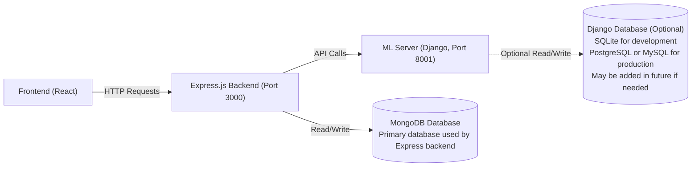

# Renal Care Management System - ML Server

This is the ML server for the Renal Care Management System. It is built using Django and provides REST API endpoints for making predictions using the trained machine learning models. The ML server is designed to work alongside the Express.js backend and serves predictions to the frontend applications.

## Features

- **JWT Authentication**: Secure endpoints using the same JWT tokens as Express.js backend
- **Role-based Access**: Restrict prediction endpoints to doctors and nurses only
- **Dry Weight Change Prediction**: Predicts if dry weight will change in next dialysis session
- **URR Risk Prediction**: Predicts if URR will go to risk region (inadequate) next month
- **Hemoglobin Risk Prediction**: Predicts if Hb will go to risk region next month with clinical recommendations

## API Endpoints

### Health Check

```http
GET /health/ - Server health check
GET /api/ml/health/ - ML models health check
GET /api/ml/models/ - Information about available models
```

### Predictions

```http
POST /api/ml/predict/dry-weight/ - Predict dry weight change
POST /api/ml/predict/urr/ - Predict URR risk
POST /api/ml/predict/hb/ - Predict hemoglobin risk
```

## Authentication

The ML server uses JWT authentication. You must include a valid JWT token in the `Authorization` header of your requests to access the protected endpoints.

### Protected Endpoints

All prediction endpoints require authentication:

```http
POST /api/ml/predict/dry-weight/ - Requires DOCTOR or NURSE role
POST /api/ml/predict/urr/ - Requires DOCTOR or NURSE role  
POST /api/ml/predict/hb/ - Requires DOCTOR or NURSE role
```

### Public Endpoints

These endpoints don't require authentication:

```http
GET /health/ - Server health check
GET /api/ml/health/ - ML models health check
GET /api/ml/models/ - Information about available models
```

### Authorization Header

Include JWT token in requests:

```http
Authorization: Bearer <your-jwt-token>
```

## Quick Start

### Option 1: Use the startup script (Windows)

```cmd
# For Command Prompt
start_server.bat

# For PowerShell
.\start_server.ps1
```

### Option 2: Manual setup

1. Install Python dependencies:

    ```bash
    pip install -r requirements.txt
    ```

2. Run migrations:

    ```bash
    python manage.py migrate
    ```

3. Start the server:

    ```bash
      python manage.py runserver 8001
    ```

## Testing

Run the test scripts to validate the models and API endpoints:

```bash
python test_dry_weight_features.py
```

## Usage

- The server runs on port 8001 and provides REST API endpoints for ML predictions.

- You can make requests to these endpoints from the Express.js backend or curl/ Postman for testing.

### Example API Calls

#### Dry Weight Prediction

```bash
curl -X POST http://localhost:8001/api/ml/predict/dry-weight/ \
  -H "Content-Type: application/json" \
  -H "Authorization: Bearer <your-jwt-token>" \
  -d '{
    "patient_id": "RHD_THP_001",
    "age": 45,
    "gender": "Male",
    "height": 170.5,
    "weight": 70.2,
    "systolic_bp": 140,
    "diastolic_bp": 90,
    "pre_dialysis_weight": 72.5,
    "post_dialysis_weight": 69.8,
    "ultrafiltration_volume": 2.7,
    "dialysis_duration": 4.0
  }'
```

#### URR Prediction

```bash
curl -X POST http://localhost:8001/api/ml/predict/urr/ \
  -H "Content-Type: application/json" \
  -H "Authorization: Bearer <your-jwt-token>" \
  -d '{
    "patient_id": "RHD_THP_002",
    "pre_dialysis_urea": 120,
    "dialysis_duration": 4.0,
    "blood_flow_rate": 300,
    "dialysate_flow_rate": 500,
    "ultrafiltration_rate": 800,
    "access_type": "fistula",
    "kt_v": 1.4
  }'
```

#### Hemoglobin Prediction

```bash
curl -X POST http://localhost:8001/api/ml/predict/hb/ \
  -H "Content-Type: application/json" \
  -H "Authorization: Bearer <your-jwt-token>" \
  -d '{
    "patient_id": "RHD_THP_003",
    "albumin": 35.2,
    "bu_post_hd": 8.5,
    "bu_pre_hd": 25.3,
    "s_ca": 2.3,
    "scr_post_hd": 450,
    "scr_pre_hd": 890,
    "serum_k_post_hd": 3.8,
    "serum_k_pre_hd": 5.2,
    "serum_na_pre_hd": 138,
    "ua": 6.8,
    "hb_diff": -0.5,
    "hb": 9.5
  }'
```

## Model Files

`ml_models/models/` directory:

NOTE: Please Read also [README.md](ml_models/trained_models/README.md) for details about the models and their features.

- dry_weight_model.pkl
- hb_model.pkl
- urr_model.pkl
- urr_lightGbm_model.pkl (Not currently used)
- xgb_model_for_hb.pkl (Not currently used)

## Integration with Express.js Backend

The ML server is designed to work alongside the Express.js backend:

- Express.js backend runs on port 3000
- ML server runs on port 8001
- CORS is configured to allow requests from the Express.js server

## Architecture



## Project Structure

```text
ML_Server/
├── ml_server/              # Main Django project
│   ├── __init__.py
│   ├── settings.py         # Django settings
│   ├── urls.py             # URL configuration
│   ├── wsgi.py             # WSGI application
│   └── asgi.py             # ASGI application
├── ml_models/              # Django app for ML models and predictions
│   ├── __init__.py
│   ├── apps.py             # App configuration
│   ├── views.py            # API views for predictions
│   ├── serializers.py      # Serializers for input validation
│   ├── services.py         # Services for loading models and making predictions
│   ├── urls.py             # URL configuration for ML endpoints
│   └── trained_models/     # Directory for trained model files
│       ├── README.md       # Details about the models
│       ├── dry_weight_model.pkl     # Trained model for dry weight prediction
│       ├── urr_model.pkl            # Trained model for URR prediction
│       ├── hb_model.pkl             # Trained model for hemoglobin prediction
│       ├── urr_lightGbm_model.pkl   # (Not currently used) LightGBM model for URR prediction
│       └── xgb_model_for_hb.pkl     # (Not currently used) XGBoost model for hemoglobin prediction
├── requirements.txt              # Python dependencies
├── manage.py                     # Django management script
├── start_server.bat              # Windows batch startup script
├── start_server.ps1              # PowerShell startup script
├── Dockerfile.dev                # Dockerfile for development environment
├── docker-compose.dev.yml        # Docker Compose file for development environment
├── .env.example                  # Example environment variables file
├── test_dry_weight_features.py   # Test script for dry weight prediction features
├── DOCKER.md                     # Instructions for Dockerization
├── ENV.md                        # Instructions for environment variable configuration
└── README.md                     # This file
```

## Security Configuration

Please Read the [ENV.md](ENV.md) file for details about environment variables and security configuration.

### Environment Variables

Make sure to set the same `JWT_SECRET` in both servers:

**Express.js Backend (.env):**

```env
JWT_SECRET=your-super-secret-jwt-key-here-change-in-production
```

**ML Server (.env):**

```env
JWT_SECRET=your-super-secret-jwt-key-here-change-in-production
```

### Role-based Access Control

- **DOCTOR**: Full access to all prediction endpoints
- **NURSE**: Full access to all prediction endpoints  
- **ADMIN**: Currently not required for ML predictions

### Token Requirements

- Valid JWT token in `Authorization` header
- Token must contain `'id'` and `'role'` fields
- Token must be signed with the correct `JWT_SECRET`

## Dockerization

Please Read the [DOCKER.md](DOCKER.md) file for details about Dockerizing the ML server and running it in a containerized environment.
